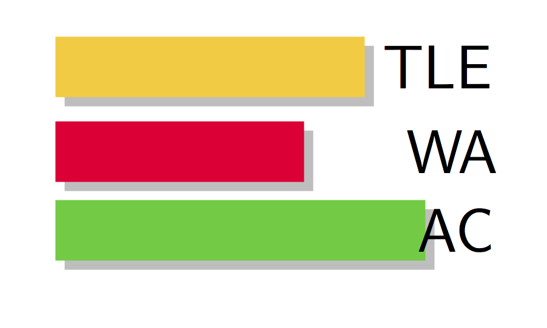

# tikz-gallery
My small TikZ gallery

## koistudy-icon

| Created    | Last Update | Description          | Source               |
| ---------- | ----------- | -------------------- | -------------------- |
| 2016.09.01 | 2016.09.01  | Icon of koistudy.net | https://git.io/vFWk7 |

## Square-wave

| Created    | Last Update | Description                   | Source               |
| ---------- | ----------- | ----------------------------- | -------------------- |
| 2017.06.07 | 2017.06.07  | Fourier Series of Square Wave | https://git.io/vHrAL |

## JOI-style

| Created    | Last Update | Description               | Source               |
| ---------- | ----------- | ------------------------- | -------------------- |
| 2017.07.06 | 2017.07.06  | JOI style profile picture | https://git.io/vQwmS |

| Original                     | Example 1                 | Example 2                         |
| ---------------------------- | ------------------------- | --------------------------------- |
|  |  |  |

## Taeguekgi(태극기)

| Created    | Last Update | Description  | Source               |
| ---------- | ----------- | ------------ | -------------------- |
| 2017.11.12 | 2017.11.12  | TikZ로 그린 태극기 | https://git.io/vFw18 |

